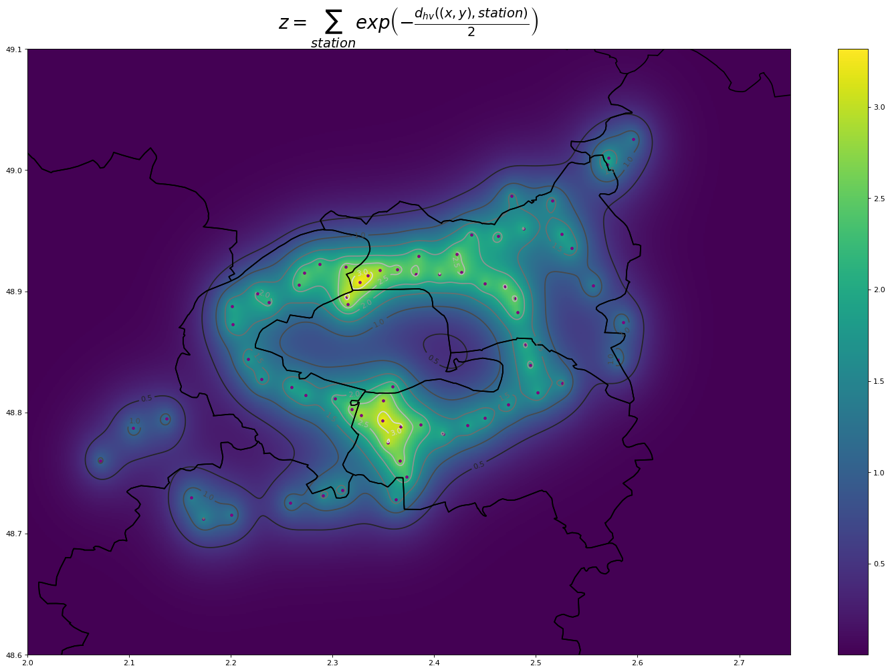
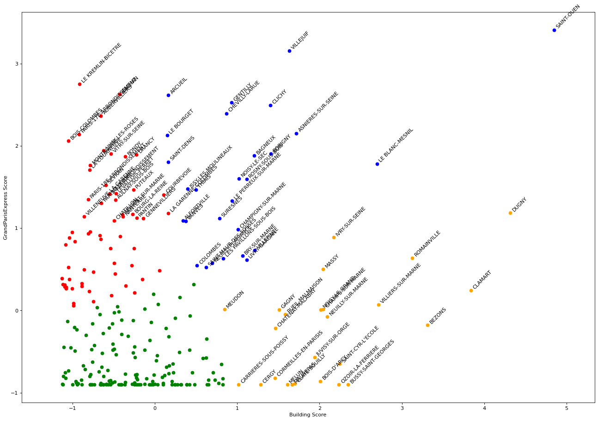
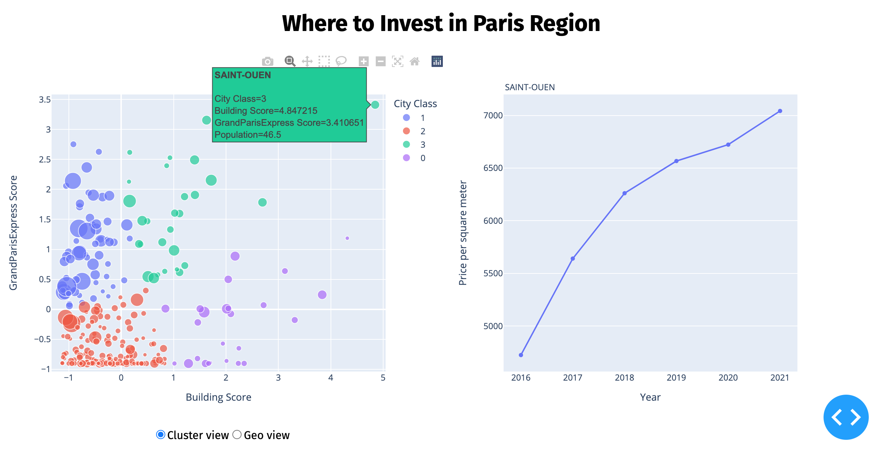

# Where to Invest in Paris region

By defining a Building Score and a Grand Paris Express Score I was able to classify the cities of the Paris region in order to determine the cities in which it seems interesting to invest. The results obtained are in line with the investment advice available on the Internet. Finally, a web application using these results has been designed to facilitate decision-making according to the profile of each user.

A complete report of this Data project can be found in the `report` folder.

## Author
[@nordine-marie](https://www.github.com/nordine-marie) - Student at TELECOM SudParis


## Screenshots







## Documentation

### Spark

My configuration for the spark project :

| | version |  
| ------------- | --------------- |  
|Java|openjdk 15.0.1 2020-10-20|  
|sbt|stable 1.5.8|  
|Scala|2.12.15|  
|Spark|3.2.0|  

Open the `project` folder as a Scala/Spark project in your IDE.

### Jupyter Notebook

Open `notebooks/clusterizations.ipynb` with a Jupyter IDE.

### Dash application

```bash
cd dashapp
python3 -m venv ./venv
source bin/activate

pip install -r requirements.txt
python3 app.py
```

Then access `localhost:8050` on your web browser.

## Demo

[wtoi-dashapp.herokuapp.com](https://wtoi-dashapp.herokuapp.com/)

